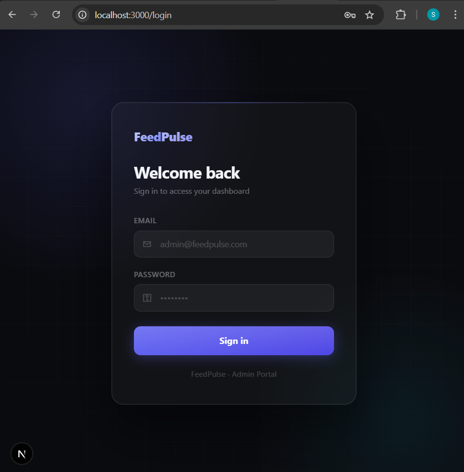
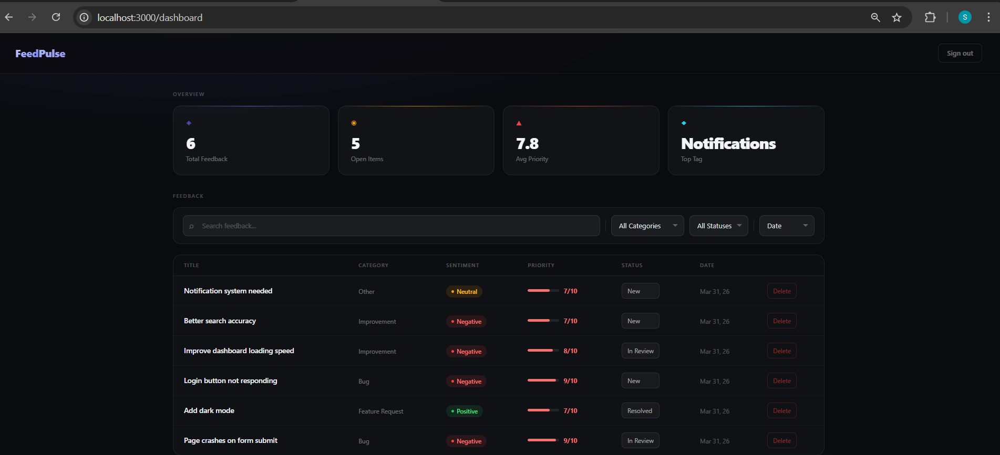

# FeedPulse — AI-Powered Product Feedback Platform

A full-stack app for collecting and analysing product feedback using Google Gemini AI.

## Tech Stack
- **Frontend**: Next.js 14, TypeScript, Tailwind CSS
- **Backend**: Node.js, Express, TypeScript
- **Database**: MongoDB + Mongoose
- **AI**: Google gemini-2.5-flash

## How to Run Locally

### Prerequisites
- Node.js 18+, MongoDB running locally

## Demo Access

### Admin Login
- URL: http://localhost:3000/login
- Email: (value from ADMIN_EMAIL in .env)
- Password: (value from ADMIN_PASSWORD in .env)

> Note: Run `npm run seed` in the backend to create the admin user before logging in.

### Backend
```bash
cd backend
npm install
cp .env.example .env   # fill in your values
npm run seed           # creates admin user
npm run dev
```

### Frontend
```bash
cd frontend
npm install
cp .env.example .env.local
npm run dev
```

Open http://localhost:3000 to submit feedback.
Open http://localhost:3000/dashboard to view the admin panel.

## Environment Variables

| Variable | Description |
|----------|-------------|
| MONGO_URI | MongoDB connection string |
| GEMINI_API_KEY | From aistudio.google.com |
| JWT_SECRET | Any random secret string |
| ADMIN_EMAIL | Admin login email |
| ADMIN_PASSWORD | Admin login password |

## Screenshots

## Feedback Submission Page


## Login Page


## Admin Dashboard


## What I'd Build Next
- Email notifications when high-priority feedback is submitted
- Public changelog so users can see what was built from their feedback
- Multi-team support with separate workspaces
